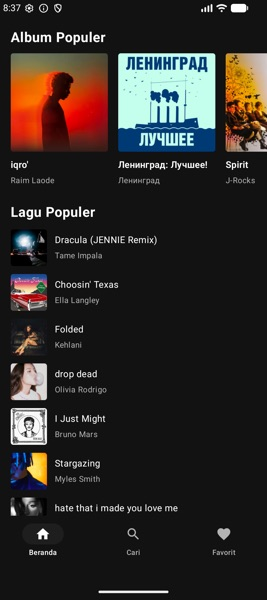
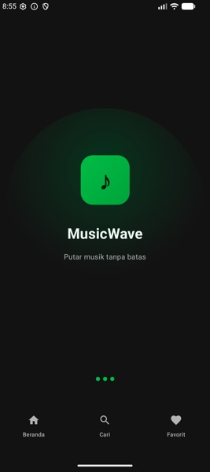
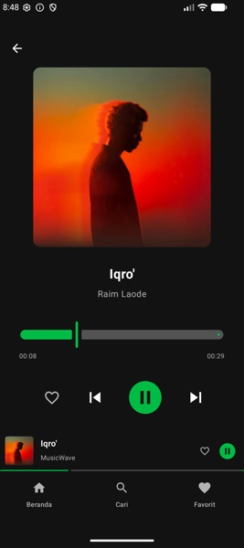
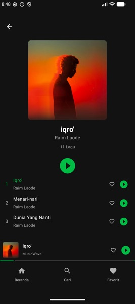
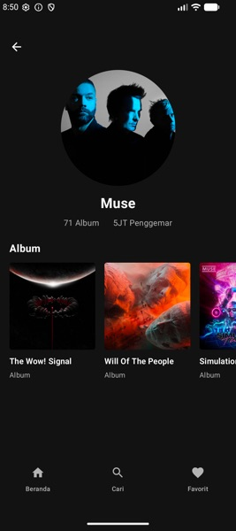

# MusicWave

<p align="center">
  
</p>

<h3 align="center">Putar musik tanpa batas</h3>

<p align="center">
  Aplikasi music player Android modern dengan desain Spotify-inspired dark theme.
  Menggunakan Deezer API untuk streaming musik gratis tanpa perlu API key.
</p>

---

## Screenshots

<p align="center">
  
  &nbsp;&nbsp;
  
  &nbsp;&nbsp;
  
  &nbsp;&nbsp;
  
  &nbsp;&nbsp;
  
</p>

---

## Fitur

| Fitur | Deskripsi |
|-------|-----------|
| **Splash Screen** | Animated splash dengan efek glow dan loading dots |
| **Browse / Home** | Album & lagu populer dari Deezer charts dengan pull-to-refresh |
| **Search** | Pencarian real-time untuk artis, album, dan lagu |
| **Artist Detail** | Profil artis, jumlah album & fan, daftar album |
| **Album Detail** | Daftar lagu lengkap, play all, toggle favorite per lagu |
| **Music Player** | Full-screen player dengan album art, progress slider, play/pause |
| **Mini Player** | Player persisten di bottom bar dengan progress indicator |
| **Favorites** | Simpan lagu favorit ke database lokal (Room) |
| **Shimmer Loading** | Efek shimmer loading di setiap halaman |
| **Foreground Service** | Playback berjalan di background dengan notifikasi |

---

## Tech Stack

| Kategori | Teknologi |
|----------|-----------|
| **Language** | Kotlin 2.0.21 |
| **UI** | Jetpack Compose + Material3 |
| **DI** | Hilt (Dagger) 2.51.1 |
| **Networking** | Retrofit 2.9.0 + OkHttp 4.12.0 |
| **JSON** | Moshi 1.15.1 |
| **Database** | Room 2.6.1 |
| **Pagination** | AndroidX Paging 3 (3.3.2) |
| **Image** | Coil Compose 2.6.0 |
| **Media** | Media3 ExoPlayer 1.3.1 |
| **Navigation** | Jetpack Navigation Compose 2.8.4 |
| **Loading** | Compose Shimmer 1.3.0 |
| **API** | Deezer API (`https://api.deezer.com/`) |

---

## Arsitektur

Menggunakan **Clean Architecture** dengan multi-module:

```
MusicWave/
├── app/                    # Main application module
│   ├── data/               # Repository implementation
│   ├── di/                 # Hilt modules
│   ├── navigation/         # NavGraph & Screen routes
│   ├── player/             # MusicService (foreground)
│   └── ui/                 # Theme & SplashScreen
│
├── core/                   # Shared core modules
│   ├── common/             # Utilities & constants
│   ├── domain/             # Models & repository interface
│   ├── network/            # Deezer API (Retrofit)
│   ├── database/           # Room database
│   └── ui/                 # Shared components & theme
│
└── feature/                # Feature modules (per screen)
    ├── browse/             # Home screen
    ├── search/             # Search screen
    ├── artist/             # Artist detail
    ├── release/            # Album detail
    ├── player/             # Full player + mini player
    └── favorites/          # Favorites screen
```

**Pattern:** MVVM + Repository + Paging 3

---

## Struktur Modul

| Modul | Deskripsi |
|-------|-----------|
| `:app` | Application entry point, navigation, MusicService |
| `:core:common` | Constants, Resource wrapper |
| `:core:domain` | Domain models (Artist, Release, Track, etc.) & repository interface |
| `:core:network` | Retrofit API, DTOs, mappers, DI |
| `:core:database` | Room DB, DAO, entities, DI |
| `:core:ui` | Theme, colors, shared components (TrackRow, Shimmer, etc.) |
| `:feature:browse` | Home screen - chart albums & tracks |
| `:feature:search` | Search - artists, albums, tracks |
| `:feature:artist` | Artist detail - profile & albums |
| `:feature:release` | Album detail - track list & playback |
| `:feature:player` | Full player + mini player |
| `:feature:favorites` | Favorites list from local DB |

---

## API

Menggunakan **Deezer API** (gratis, tanpa API key):

| Endpoint | Fungsi |
|----------|--------|
| `GET /chart/0/albums` | Album populer |
| `GET /chart/0/tracks` | Lagu populer |
| `GET /search/artist` | Cari artis |
| `GET /search/album` | Cari album |
| `GET /search/track` | Cari lagu |
| `GET /artist/{id}` | Detail artis |
| `GET /artist/{id}/albums` | Album artis |
| `GET /artist/{id}/top` | Lagu top artis |
| `GET /album/{id}` | Detail album |

---

## Persyaratan

- Android Studio Ladybug (2024.2.1) atau lebih baru
- JDK 17
- Android SDK 35
- Device/emulator dengan minimum SDK 24 (Android 7.0)

---

## Getting Started

1. **Clone repository**
   ```bash
   git clone https://github.com/yourusername/MusicWave.git
   cd MusicWave
   ```

2. **Buka di Android Studio**
   - Open Android Studio → File → Open → pilih folder `MusicWave`

3. **Sync Gradle**
   - Tunggu sync selesai (otomatis)

4. **Run aplikasi**
   - Pilih device/emulator → Run ▶️

---

## Permissions

| Permission | Keterangan |
|------------|------------|
| `INTERNET` | Akses Deezer API |
| `ACCESS_NETWORK_STATE` | Cek koneksi jaringan |
| `FOREGROUND_SERVICE` | Jalankan music service di background |
| `FOREGROUND_SERVICE_MEDIA_PLAYBACK` | Tipe foreground service untuk media (Android 14+) |

---

## Screenshots Detail

### Splash Screen
Animated splash screen dengan efek glow hijau dan loading dots. Menampilkan tagline "Putar musik tanpa batas".

<p align="center">
  
</p>

### Home Screen
Album populer (horizontal scroll) dan lagu populer (vertical list) dari Deezer charts.

<p align="center">
  
</p>

### Music Detail & Player
Full-screen player dengan album art besar, progress slider, dan kontrol play/pause.

<p align="center">
  
</p>

### Artist Detail
Profil artis dengan daftar album dan statistik.

<p align="center">
  
</p>

### Artist Overview
Halaman artist dengan navigasi album.

<p align="center">
  
</p>

---

## License

```
MIT License

Copyright (c) 2025 MusicWave

Permission is hereby granted, free of charge, to any person obtaining a copy
of this software and associated documentation files (the "Software"), to deal
in the Software without restriction, including without limitation the rights
to use, copy, modify, merge, publish, distribute, sublicense, and/or sell
copies of the Software, and to permit persons to whom the Software is
furnished to do so, subject to the following conditions:

The above copyright notice and this permission notice shall be included in all
copies or substantial portions of the Software.

THE SOFTWARE IS PROVIDED "AS IS", WITHOUT WARRANTY OF ANY KIND, EXPRESS OR
IMPLIED, INCLUDING BUT NOT LIMITED TO THE WARRANTIES OF MERCHANTABILITY,
FITNESS FOR A PARTICULAR PURPOSE AND NONINFRINGEMENT. IN NO EVENT SHALL THE
AUTHORS OR COPYRIGHT HOLDERS BE LIABLE FOR ANY CLAIM, DAMAGES OR OTHER
LIABILITY, WHETHER IN AN ACTION OF CONTRACT, TORT OR OTHERWISE, ARISING FROM,
OUT OF OR IN CONNECTION WITH THE SOFTWARE OR THE USE OR OTHER DEALINGS IN THE
SOFTWARE.
```

---

<p align="center">
  Made with ❤️ for music lovers
</p>
